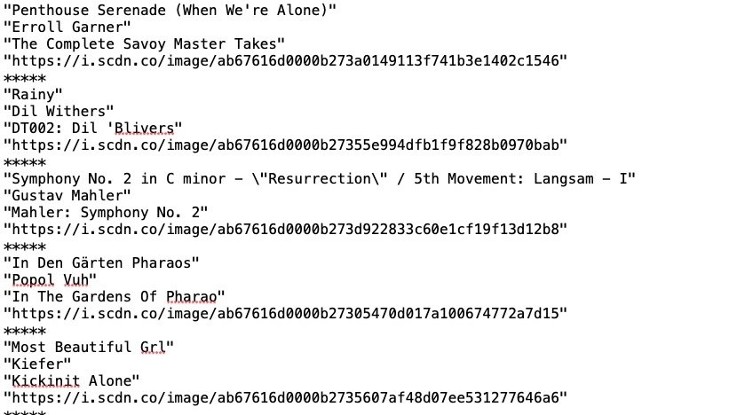

### LIKED SONGS

This app saves your Spotify liked songs to a txt file. What if you wanted to terminate your account but you wanted to remember
all the songs you'd saved? Then this app would come in handy. 

The main challenge was to parse the massive amount of metadata supplied by Spotify's API. You only need the song title, album, artwork and artist.
Also, they only let you get 50 songs' worth of data at a time.

To run this app you'll need a config.properties file in your resources folder. It will look like this:
'''
client.id={blah}
client.secret={blah}
total.songs=0
'''

You'll get the client id and client secret from https://developer.spotify.com/documentation/web-api/concepts/apps. Follow the instructions to create
an app and make sure you set the Redirect URI to http://localhost:8888/callback

(Total songs is the amount of liked songs you have saved.)
