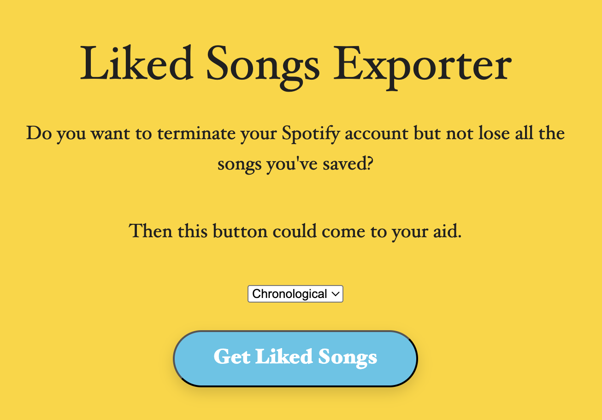
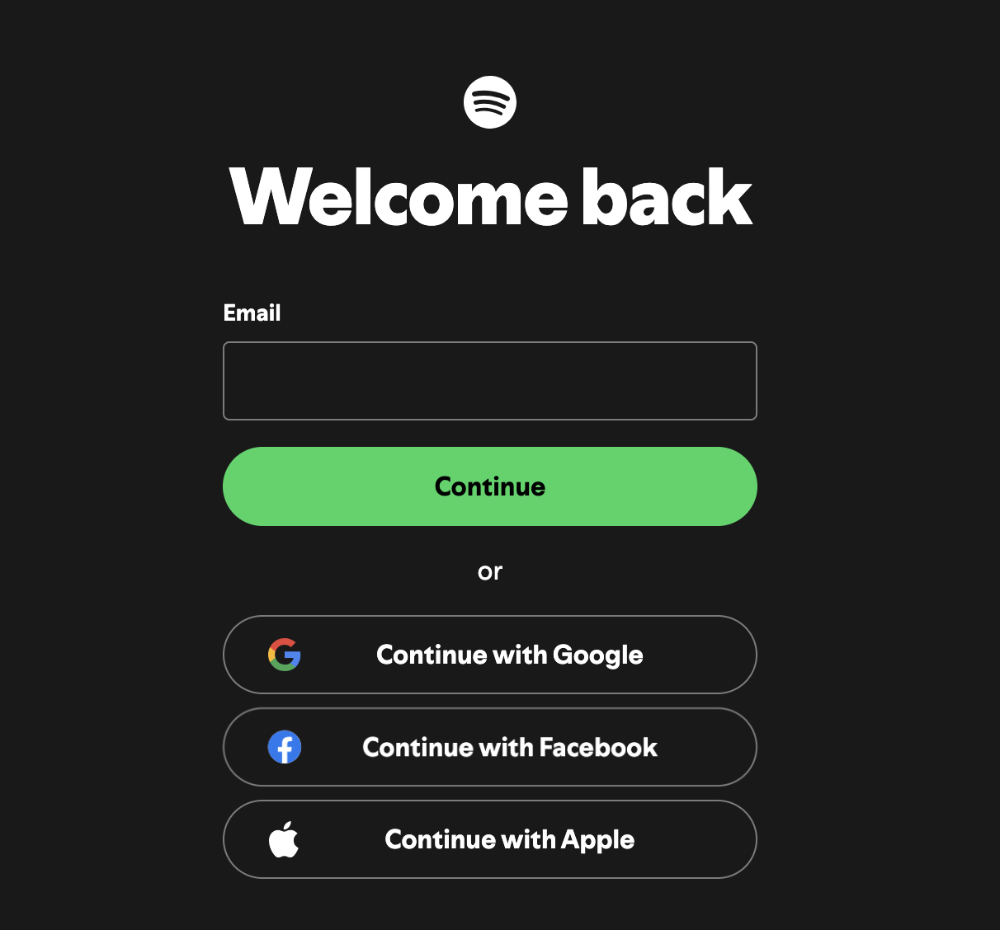

Here’s a Spring Boot app that allows you to get all your liked songs from Spotify with the click of a button.

You’ll be redirected to Spotify to log in to your account.

Your liked songs will then be displayed for you to print.

It makes use of the following frameworks:

* Spring Beans for autowiring service classes and configuration management (IoC)
* OkHttp Client to manage Spotify OAuth 2.0 and token flows
* SHA-256 hashing and Base64 encoding for Proof Key for Code Exchange authorisation
* Google Gson and Jackson for robust parsing of Spotify API responses
* Thymeleaf to display the album objects on an HTML template
* Mockito and JUnit for secure unit tests of OAuth, Json parsing and Object handling

This app remains a work in progress as I move to:
* persist users’ songs to a database
* provide optional song recommendations for further music discovery

‼️ Spotify does restrict usage of their API to paid accounts. That means as a free-tier user, you won't be able to export your liked songs. 
